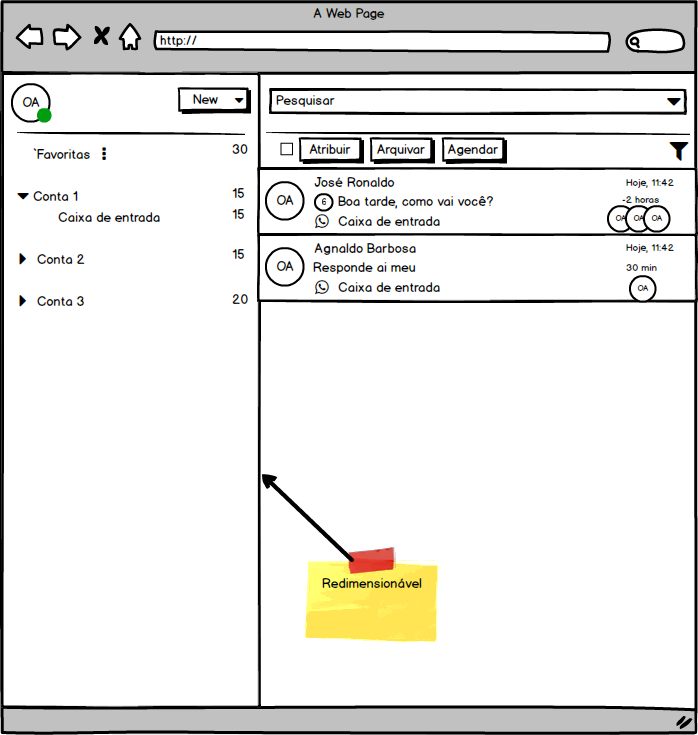
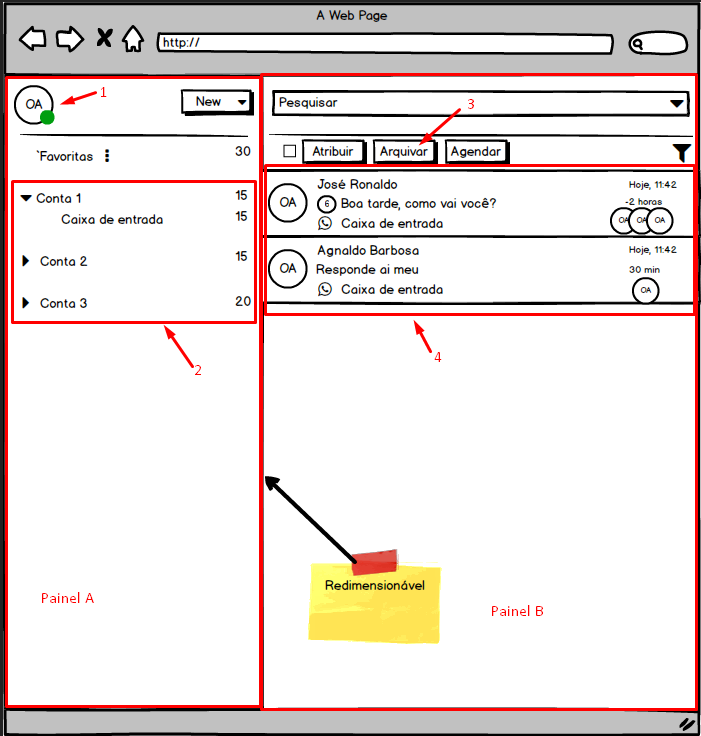
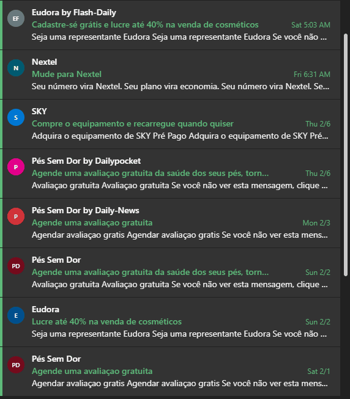

# Teste prático enContact - Frontend

Obrigado por se interessar em participar do teste para desenvolvedor Front-end da [enContact](http://www.encontact.com.br).

## O que estamos procurando

Procuramos alguém para participar do nosso time de desenvolvimento, trazendo expertise na parte de interface de usuário - com domínio e controle do CSS, técnicas de design responsivo, usabilidade e acessibilidade - e com conhecimento em react.js/typescript para poder trabalhar na base de código utilizada na empresa.

## O que será avaliado no desafio

O desafio consiste em criar uma pequena aplicação, seguindo os itens abaixo.
Alguns pontos importantes para citar:

* Layout/apresentação visual.
* Cuidados com usabilidade e responsividade.
* Cuidados na estrutura e organização da tela - principalmente em relação à hierarquia visual.
* Reutilização e composição de componentes visuais.

## Regras/Condições

1. As telas são um rascunho da disposição e apresentação - próximo a como você receberia uma análise - monte o layout que achar adequado lembrando do que será avaliado.
2. Os dados serão consumidos através de uma api externa.
   1. Detalhes desta API são apresentados em seguida.
3. Utilizar globalização. (Adicionar algum botão para que possa alterar a linguagem).
4. Utilizar tematização. (Adicionar algum botão para que possa escolher o tema:
Dark ou Light).
5. A tela deve ser responsiva. (Permita um acesso confortável tanto em desktop quanto em mobile).
6. Criar uma tela de login simples
   1. Somente usuário logado poder acessar a Main page.
   2. Não é necessário validar credenciais, pode utilizar login fixo. (Ex. User: Admin, Pass: Admin).
7. Se possível, pense em acessibilidade, utilize boas práticas.
8. Utilize React.js (Se conhecer, preferencialmente Typescript).

## Componentes / Comportamentos

1. Lembre-se que o principal objetivo é Layout, apresentação visual, usabilidade e responsividade.
2. O componente 1 deve:
   1. Ao clicar apresentar um menu para que possa ser feito o Logout.
3. O componente 2 deve:
   1. Listar a arvore de menu a partir dos items obtidos pela api: <http://my-json-server.typicode.com/EnkiGroup/DesafioFrontEnd2026Jr/menus>
      1. Exemplo:
      * Menu
        * subMenu
        * subMenu
      * Menu
        * subMenu
   2. Ao selecionar um item (subMenu - Caixa de entrada, por exemplo), deve atualizar a listagem representada pelo componente 4, com os itens relacionados ao subMenu.
4. O componente 3 deve:
   1. Ao clicar no botão "Arquivar" os itens selecionados do componente 4 devem ser removidos da listagem.
5. O componente 4 deve:
   1. Apresentar os dados relacionados ao item selecionado no componente 2, através da api:
      ➡️ <http://my-json-server.typicode.com/EnkiGroup/DesafioFrontEnd2026Jr/items/{id> do subMenu}
   2. Cada item (Card) deve apresentar as seguintes informações (Exemplo utilizando o primeiro item da imagem):
      1. Name (José Ronaldo -> Primeiro texto)
      2. Subject (Boa tarde, como vai você? -> Segundo texto)
      3. Owner (OA -> Círculo maior com as iniciais)
      4. Users (OA, OA, OA -> Três círculos menores com as iniciais)
      5. OBS: As demais informações do Card podem ser fixas.
   3. Quando o usuário passar o mouse sobre a linha, deve ser apresentada a opção de selecionar o item da lista (Apresentar um checkbox no lugar das iniciais do Owner).
   4. Ao selecionar o item, todas as Iniciais devem ser apresentadas como opção de seleção para permitir múltiplas escolhas.
   5. Ao desmarcar todas as opções, o sistema deve voltar a apresentar as Iniciais.
   6. Adicione qualquer funcionalidade ou melhoria adicional, seja criativo e indice no Pull Request qual foi a funcionalidade adicional. Nos surpreenda :-)
   7. OBS: Segue um exemplo visual do comportamento desejado extraído de um e-mail Office365:

## Finalizando

Qualquer dúvida, fale conosco.

## Agradecimentos

* [Office365](https://office365.com) pela ideia de front-end.
